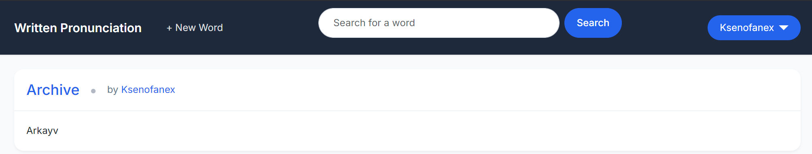

# Written Pronunciation

An English written pronunciation site for Turkish hard of hearing and deaf people who can't listen to words' verbal pronunciation.



## Features

- Brutalist "Ink Slab + Brutalist Mono" design with Archivo Black poster typography and IBM Plex Mono metadata
- Dark mode with full theme inversion and localStorage persistence
- Staggered slide-up animations on word lists with hover accent bars
- User authentication and authorization
- Word CRUD (create, read, update, delete)
- Search functionality
- Per-user word lists
- Pagination
- REST API with token authentication
- Interactive API documentation (Swagger UI via drf-spectacular)
- Comprehensive test suite (54 tests)

## Tech Stack

| Layer | Technology |
|-------|-----------|
| Backend | Django 5.1, Django REST Framework 3.15 |
| Auth | django-allauth 64.x, dj-rest-auth 7.x |
| API Docs | drf-spectacular (OpenAPI 3.0) |
| Forms | django-crispy-forms + crispy-bootstrap5 |
| Frontend | Bootstrap 5, custom CSS design system |
| Fonts | Archivo Black, IBM Plex Mono, Inter |
| Testing | pytest, factory-boy, django-test-plus |
| Package Manager | uv + pyproject.toml |
| Database | SQLite (development) |

## Quick Start

### Prerequisites

- Python 3.12+
- [uv](https://docs.astral.sh/uv/) package manager

### Setup

```bash
git clone https://github.com/Ksenofanex/written-pronunciation.git
cd written-pronunciation

# Create environment file
cp .env.example .env
# Edit .env with your SECRET_KEY (generate one at https://djecrety.ir/)

# Install dependencies and create virtual environment
uv sync

# Run migrations
uv run python manage.py makemigrations
uv run python manage.py migrate

# Start the server
uv run python manage.py runserver
```

Then open http://localhost:8000/

### Running Tests

```bash
uv run pytest
```

### Environment Variables

Create a `.env` file in the project root:

```
DEBUG=True
SECRET_KEY=your-secret-key-here
```

Set `DEBUG=False` in production.

## API

| Endpoint | Description |
|----------|-------------|
| `/api/words/` | Word list and creation |
| `/api/words/<id>/` | Word detail, update, delete |
| `/api/docs/` | Swagger UI documentation |
| `/api/schema/` | OpenAPI 3.0 schema |
| `/api/v1/rest-auth/` | Authentication endpoints |
| `/api/v1/rest-auth/registration/` | Registration endpoint |

## Project Structure

```
written-pronunciation/
├── dictionary/          # Word model, views, templates
├── users/               # Custom user model, signup
├── api/                 # DRF viewsets, serializers, filters
├── templates/           # Django templates (Ink Slab design)
├── static/
│   ├── css/style.css    # Full design system (~1200 lines)
│   └── js/theme.js      # Dark mode toggle (no-flash IIFE)
├── written_pronunciation/
│   ├── settings.py      # Django 5.1 settings (pathlib)
│   └── urls.py          # URL configuration
└── pyproject.toml       # Dependencies (managed by uv)
```

## Design

The frontend uses an "Ink Slab + Brutalist Mono" hybrid aesthetic:

- **Word list**: Massive uppercase Archivo Black type with staggered entrance animations and hover accent bars
- **Detail pages**: Poster-scale typography (up to 8rem)
- **Navbar**: Black bar with 3px border, underline search, IBM Plex Mono nav links
- **Dark mode**: Full color inversion — navbar flips to light, backgrounds to near-black
- **Forms**: Brutalist underline inputs (auth) and boxed inputs (word CRUD)
- **Responsive**: Mobile-first with breakpoints at 768px and 992px

## License

This project is open source. See the repository for license details.
